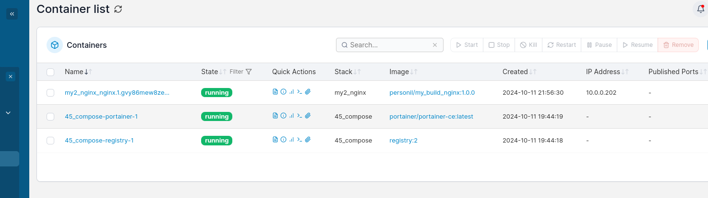

## <p style="text-align: center;">ОТЧЕТ</p> <p style="text-align: center;">по домашнему заданию к занятию 4 «Оркестрация группой Docker контейнеров на примере Docker Compose»</p>
## <p style="text-align: right;">Выполнил: студент Порсев И.С.</p>


## Задача 1

- Установить docker и docker compose plugin на свою linux рабочую станцию или ВМ.
- Если dockerhub недоступен создайте файл /etc/docker/daemon.json с содержимым: `{"registry-mirrors": ["https://mirror.gcr.io", "https://daocloud.io", "https://c.163.com/", "https://registry.docker-cn.com"]}`
- Зарегистрироваться и создать публичный репозиторий с именем "custom-nginx" на https://hub.docker.com (ТОЛЬКО ЕСЛИ У ВАС ЕСТЬ ДОСТУП);
- Скачать образ nginx:1.21.1;
- Создать Dockerfile и реализовать в нем замену дефолтной индекс-страницы(/usr/share/nginx/html/index.html), на файл index.html с содержимым:
```html
<html>
<head>
Hey, Netology
</head>
<body>
<h1>I will be DevOps Engineer!</h1>
</body>
</html>
```

- Собрать и отправить созданный образ в свой dockerhub-репозитории c tag 1.0.0 (ТОЛЬКО ЕСЛИ ЕСТЬ ДОСТУП).
- Предоставить ответ в виде ссылки на https://hub.docker.com/<username_repo>/custom-nginx/general .

### <div style="text-align: center;">Решение</div>
```html
https://hub.docker.com/repository/docker/personil/my_build_nginx/general
```


## Задача 2

1. Запустить образ custom-nginx:1.0.0 командой docker run в соответвии с требованиями:
\`имя контейнера ФИО-custom-nginx-t2`\
`контейнер работает в фоне`\
`контейнер опубликован на порту хост системы 127.0.0.1:8080`
2. Не удаляя, переименовать контейнер в "custom-nginx-t2"
3. Выполнить команды  `date +"%d-%m-%Y %T.%N %Z" ; sleep 0.150 ; docker ps ; ss -tlpn | grep 127.0.0.1:8080  ; docker logs custom-nginx-t2 -n1 ; docker exec -it custom-nginx-t2 base64 /usr/share/nginx/html/index.html`
4. Не удаляя, переименовать контейнер в "custom-nginx-t2"
Убедитесь с помощью curl или веб браузера, что индекс-страница доступна.
В качестве ответа приложите скриншоты консоли, где видно все введенные команды и их вывод.
### <div style="text-align: center;">Решение</div>


## Задача 3

1. Воспользоваться `docker help` или `google`, чтобы узнать как подключиться к стандартному потоку ввода/вывода/ошибок контейнера "custom-nginx-t2".
2. Подключится к контейнеру и нажмите комбинацию Ctrl-C.
3. Выполнить `docker ps -a` и объяснить своими словами почему контейнер остановился.
4. Перезапустить контейнер
5. Зайти в интерактивный терминал контейнера "custom-nginx-t2" с оболочкой bash.
6. Установить текстовый редактор (vim, nano итд) с помощью apt-get.
7. Отредактировать файл `"/etc/nginx/conf.d/default.conf"`, заменив порт "listen 80" на "listen 81".
8. Запомнить(!) и выполнить команду nginx -s reload, а затем внутри контейнера curl http://127.0.0.1:80 ; curl http://127.0.0.1:81.
9. Выйти из контейнера, набрав в консоли exit или Ctrl-D.
10. Проверить вывод команд: ss -tlpn | grep 127.0.0.1:8080 , docker port custom-nginx-t2, curl http://127.0.0.1:8080. Кратко объясните суть возникшей проблемы.
11. - Это дополнительное, необязательное задание. Попробовать самостоятельно исправить конфигурацию контейнера, используя доступные источники в интернете. Не изменяйте конфигурацию nginx и не удаляйте контейнер. Останавливать контейнер можно. пример источника
12. Удалить запущенный контейнер "custom-nginx-t2", не останавливая его.(воспользуйтесь --help или google)

### <div style="text-align: center;">Решение</div>
>по пунктам 1-10

>по пунктам 11-12


## Задача 4

1. Запустить первый контейнер из образа centos c любым тегом в фоновом режиме, подключив папку текущий рабочий каталог `$(pwd)` на хостовой машине в `/data` контейнера, используя ключ -v.
2. Запустить второй контейнер из образа debian в фоновом режиме, подключив текущий рабочий каталог `$(pwd)` в `/data` контейнера.
3. Подключится к первому контейнеру с помощью `docker exec` и создайте текстовый файл любого содержания в `/data`.
4. Добавить ещё один файл в текущий каталог `$(pwd)` на хостовой машине.
5. Подключится во второй контейнер и отобразить листинг и содержание файлов в `/data` контейнера.
В качестве ответа приложите скриншоты консоли, где видно все введенные команды и их вывод.

### <div style="text-align: center;">Решение</div>


## Задача 5
1. Создать отдельную директорию и 2 файла внутри него. "compose.yaml" с содержимым:
```docker 
version: "3"
services:
  portainer:
    image: portainer/portainer-ce:latest
    network_mode: host
    ports:
      - "9000:9000"
    volumes:
      - /var/run/docker.sock:/var/run/docker.sock
```
"docker-compose.yaml" с содержимым:
```docker 
version: "3"
services:
  registry:
    image: registry:2
    network_mode: host
    ports:
    - "5000:5000"
```
И выполните команду "docker compose up -d". Какой из файлов был запущен и почему? (подсказка: https://docs.docker.com/compose/compose-application-model/#the-compose-file )

### ___Ответ:___
___Первым запускается файл `compose.yaml`, который является приоритетным файлом по сравнения с `docker-compose.yaml`. В новых версиях перешли на использование `docker-compose.yaml`, однако для поддержки предыдущих версий данный файл оставили без изменений.___

2. Отредактируйте файл compose.yaml так, чтобы были запущенны оба файла. (подсказка: https://docs.docker.com/compose/compose-file/14-include/)

3. Выполните в консоли вашей хостовой ОС необходимые команды чтобы залить образ custom-nginx как custom-nginx:latest в запущенное вами, локальное registry. Дополнительная документация: https://distribution.github.io/distribution/about/deploying/

4. Откройте страницу "https://127.0.0.1:9000" и произведите начальную настройку portainer.(логин и пароль адмнистратора)

5. Откройте страницу "http://127.0.0.1:9000/#!/home", выберите ваше local окружение. Перейдите на вкладку "stacks" и в "web editor" задеплойте следующий компоуз:
```docker
version: '3'
services:
  nginx:
    image: 127.0.0.1:5000/custom-nginx
    ports:
      - "9090:80"
```
6. Перейдите на страницу "http://127.0.0.1:9000/#!/2/docker/containers", выберите контейнер с nginx и нажмите на кнопку "inspect". В представлении <> Tree разверните поле "Config" и сделайте скриншот от поля "AppArmorProfile" до "Driver".

7. Удалите любой из манифестов компоуза (например compose.yaml). Выполните команду "docker compose up -d". Прочитайте warning, объясните суть предупреждения и выполните предложенное действие. Погасите compose-проект ОДНОЙ (обязательно!!) командой.

### ___Ответ:___
___Суть предупреждения "Docker compose" заключается в том что изменения по удалению файла в стэке не произошли и поэтому для подтверждения данных действий (в моем случае - удаление) необходимо использовать флаг `--remove-orphans`.___

В качестве ответа приложите скриншоты консоли, где видно все введенные команды и их вывод, файл compose.yaml , скриншот portainer c задеплоенным компоузом.


### <div style="text-align: center;">Решение</div>
>по пунктам 1-2


>по пункту 5


>по пункту 6



>по пункту 7

